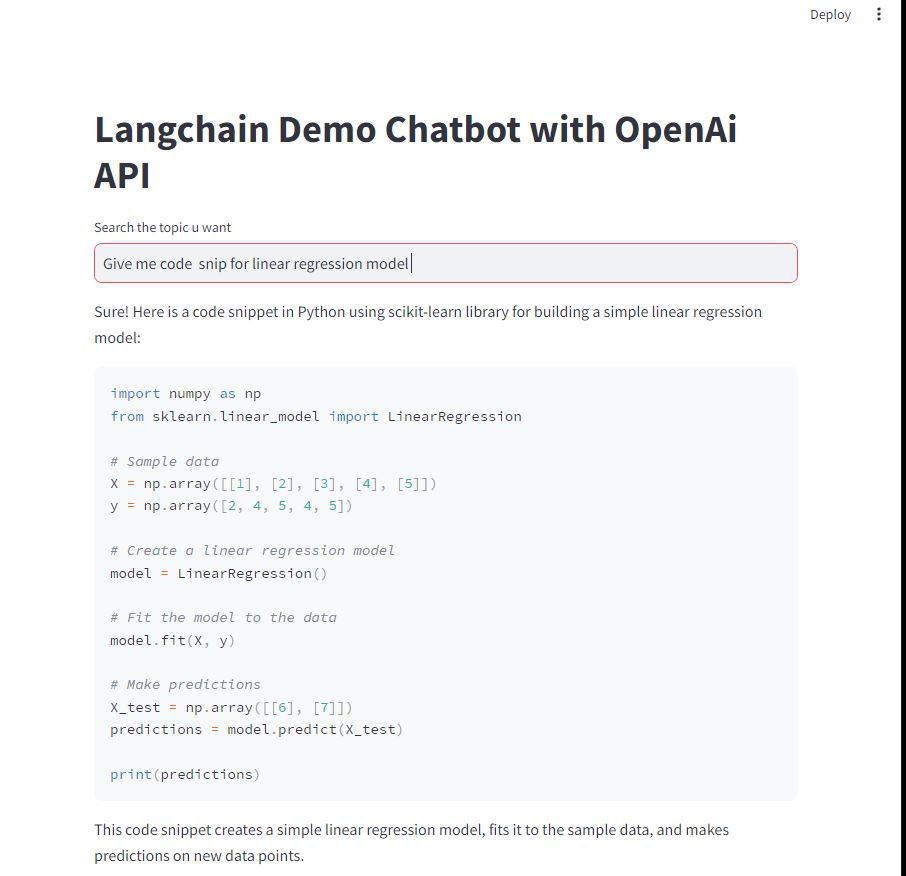
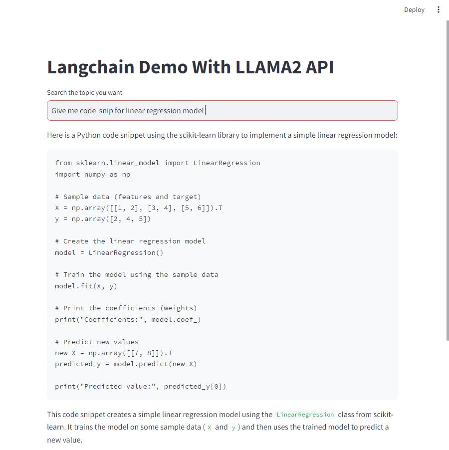
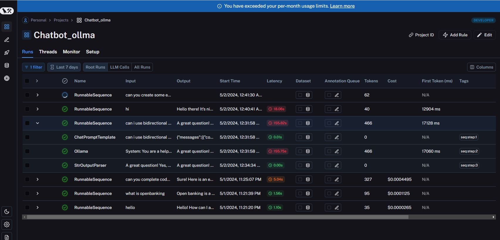

# Langchain Dual-Mode Chatbot

Welcome to the repository for the Langchain Dual-Mode Chatbot project! This project showcases the integration of two powerful language models, OpenAI's GPT and LLAMA3, using the Langchain framework. The aim is to demonstrate a versatile chatbot system where one operates via OpenAI's API and the other runs locally with Ollama, offering robust solutions for real-time and API-independent text processing.

## Project Overview

This repository contains two main components:
- `app.py`: This Streamlit application utilizes the OpenAI API to power the chatbot, offering cloud-based language model capabilities.
- `lama_app.py`: This application runs the LLAMA3 model locally through Ollama, providing an API-free, self-contained chatbot solution.

## Features

- **Two Mode Operations**: Users can choose between a cloud-based model for extensive capabilities and a local model for privacy and offline availability.
- **Interactive Chat Interfaces**: Both chatbots offer interactive interfaces built with Streamlit, allowing for real-time question answering and information retrieval.
- **Langchain Integration**: Utilizes Langchain for seamless integration and management of language models.
- **Langsmith Dashboard**: Monitor and control the chatbots' operations using the Langsmith dashboard, enhancing oversight and management.

## Screenshots

### OpenAI Chatbot Interface


### LLAMA3 Local Chatbot Interface



## Setup and Installation

### Prerequisites
- Python 3.8+
- Streamlit
- Langchain
- Ollama (for LLAMA3)

### Installation Steps

1. **Clone the repository**:
   ```bash
   [git clone https://github.com/yourusername/langchain-dual-mode-chatbot.git](https://github.com/nani2357/chatbot_using_langchain_and_ollama.git)
   cd langchain-dual-mode-chatbot

   ## Install Dependencies

```bash
pip install -r requirements.txt


## To run the OpenAI-based chatbot:
streamlit run app.py


## To run the LLAMA3 local chatbot:
streamlit lama_app.py

